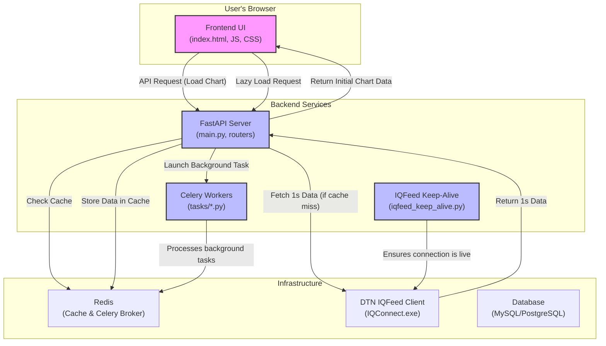

# Trading Analysis & Backtesting Platform

This is a high-performance, asynchronous web platform designed for financial market data analysis, charting, and strategy backtesting. It features a responsive frontend for data visualization and a robust FastAPI backend that handles data fetching, processing, caching, and asynchronous task management with Celery.

## Table of Contents

  - [Key Features](https://www.google.com/search?q=%23key-features)
  - [System Architecture & Data Flow](https://www.google.com/search?q=%23system-architecture--data-flow)
  - [Technology Stack](https://www.google.com/search?q=%23technology-stack)
  - [Project Structure](https://www.google.com/search?q=%23project-structure)
  - [Setup and Installation](https://www.google.com/search?q=%23setup-and-installation)
      - [Prerequisites](https://www.google.com/search?q=%23prerequisites)
      - [Backend & Worker Setup](https://www.google.com/search?q=%23backend--worker-setup)
  - [Running the Platform](https://www.google.com/search?q=%23running-the-platform)
  - [How It Works: A Deep Dive](https://www.google.com/search?q=%23how-it-works-a-deep-dive)
      - [Historical Data Flow](https://www.google.com/search?q=%23historical-data-flow)
      - [Session Management](https://www.google.com/search?q=%23session-management)
  - [API Endpoints](https://www.google.com/search?q=%23api-endpoints)
  - [Key Components Explained](https://www.google.com/search?q=%23key-components-explained)

## Key Features

  * **High-Performance Charting**: A smooth, interactive charting interface built with **Lightweight Charts™** for visualizing OHLC and volume data.
  * **On-the-Fly Resampling**: Fetches high-resolution 1-second data and uses a **Numba-accelerated** engine to resample it to any standard interval (e.g., 1m, 5m, 1h) on demand.
  * **Intelligent Caching**: A multi-layer caching system using **Redis** that caches raw 1s data, resampled interval data, and triggers background jobs to pre-aggregate data for lightning-fast subsequent requests.
  * **Lazy Loading**: The chart dynamically loads older historical data as the user scrolls back in time, ensuring a fast initial load even for large date ranges.
  * **Asynchronous Operations**: Leverages **Celery** and **Redis** to offload computationally intensive tasks like strategy optimization, ensuring the API remains responsive.
  * **Robust Data Connection**: Includes a persistent **watchdog script** (`iqfeed_keep_alive.py`) to ensure the connection to the DTN IQFeed data provider is always active and stable.
  * **Dynamic Strategy Engine**: A modular system for loading and running trading strategies, with support for high-speed, parallelized backtesting using **Numba/CUDA**.

## System Architecture & Data Flow

The platform is composed of several key components that work together to deliver a seamless experience.



1.  **Frontend**: The user interacts with the UI, selecting chart parameters and triggering API calls.
2.  **FastAPI Server**: Handles incoming HTTP requests, orchestrates data fetching and processing, and interacts with the cache.
3.  **IQFeed Client**: The external `IQConnect.exe` process that provides the live market data feed.
4.  **IQFeed Keep-Alive**: A standalone Python script that runs persistently to ensure the `IQConnect.exe` process is always active.
5.  **Redis**: Acts as a high-speed cache for market data and serves as the message broker and result backend for Celery.
6.  **Celery Workers**: Run in the background to execute long-running, asynchronous jobs like strategy optimization or data pre-aggregation.
7.  **Database**: Used for persistent storage of data (if needed, though the current implementation is cache-focused).

## Technology Stack

  * **Backend**: FastAPI, Python 3.10+
  * **Frontend**: HTML5, CSS3, JavaScript, Lightweight Charts™, Tailwind CSS, DaisyUI
  * **Data Processing**: NumPy, Pandas, Numba
  * **Task Queue**: Celery
  * **Caching/Message Broker**: Redis
  * **Data Provider**: DTN IQFeed
  * **Database ORM**: SQLAlchemy

## Project Structure

```
trading_platform_v3.1/
├── trading_backend/
│   ├── app/
│   │   ├── core/                  # Core logic: caching, strategy loading, Numba kernels
│   │   ├── dtn_iq_client.py       # Manages connection to IQFeed client
│   │   ├── models.py              # SQLAlchemy ORM models
│   │   ├── pyiqfeed/              # Library for IQFeed communication
│   │   ├── routers/               # FastAPI routers for API endpoints
│   │   ├── services/              # Business logic for data, optimization, etc.
│   │   ├── strategies/            # Trading strategy definitions
│   │   ├── tasks/                 # Celery background task definitions
│   │   ├── config.py              # Application settings
│   │   └── main.py                # FastAPI application entry point
│   ├── iqfeed_keep_alive.py       # Standalone watchdog script for IQFeed
│   └── requirements.txt         # Python dependencies
└── frontend/
    ├── static/
    │   ├── css/style.css
    │   └── js/
    │       ├── api.js             # API communication layer
    │       └── main.js            # Main frontend application logic
    └── index.html                 # Main HTML file for the single-page app
```

## Setup and Installation

### Prerequisites

  * Python 3.10+
  * Redis Server
  * DTN IQFeed client (`IQConnect.exe`) installed and credentials available.
  * A C++ compiler (required by `numba` on some systems).
  * (For Linux) `wine` and `xvfb` to run `IQConnect.exe`.

### Backend & Worker Setup

1.  **Clone the repository:**

    ```bash
    git clone <repository-url>
    cd trading_platform_v3.1/trading_backend
    ```

2.  **Create and activate a virtual environment:**

    ```bash
    python -m venv venv
    source venv/bin/activate  # On Windows: venv\Scripts\activate
    ```

3.  **Install Python dependencies:**

    ```bash
    pip install -r requirements.txt
    ```

4.  **Configure Environment Variables:**
    Create a `.env` file in the `trading_backend` directory and add your credentials. This file is loaded by `app/config.py`.

    ```env
    # .env

    # Redis Connection URL
    REDIS_URL="redis://localhost:6379/0"
    CELERY_BROKER_URL="redis://localhost:6379/0"
    CELERY_RESULT_BACKEND="redis://localhost:6379/0"

    # DTN IQFeed Credentials
    DTN_PRODUCT_ID="YOUR_DTN_PRODUCT_ID"
    DTN_LOGIN="YOUR_DTN_LOGIN"
    DTN_PASSWORD="YOUR_DTN_PASSWORD"
    ```

## Running the Platform

You need to run three separate processes in different terminals from the `trading_backend` directory.

1.  **Run the IQFeed Keep-Alive Script:**
    This script must be running first to ensure the data connection is stable.

    ```bash
    python iqfeed_keep_alive.py
    ```

2.  **Run the Celery Worker:**
    The worker will listen for and execute background tasks.

    ```bash
    celery -A app.tasks.celery_app.celery_application worker --loglevel=info -P eventlet
    ```

3.  **Run the FastAPI Server:**
    This starts the main web server for the API and frontend.

    ```bash
    uvicorn app.main:app --host 0.0.0.0 --port 8000 --reload
    ```

    You can now access the platform by navigating to `http://localhost:8000` in your web browser.

## How It Works: A Deep Dive

### Historical Data Flow

The platform's primary feature is its efficient handling of historical data requests.

1.  **User Request**: The user selects an instrument, interval, and date range and clicks "Load Chart". The frontend sends a request to the `/historical/` endpoint.
2.  **Cache Check**: The `historical_data_service` first checks Redis for a cached result matching the *exact* request parameters (e.g., `chart_data:SESSION:AAPL:1m:2024-01-01_2024-02-01`).
3.  **On-Demand Resampling (Cache Miss)**:
      * If the specific interval is not cached, the service looks for cached **1-second data** for the requested date range.
      * If the 1s data is also missing, it makes a live API call to the DTN IQFeed client to fetch the raw 1s data. This raw data is then cached on a per-day basis for future use.
      * The service uses a high-performance **Numba kernel** (`resample_ohlc_cpu_jit`) to aggregate the 1s data into the user's desired interval (e.g., 5-minute bars).
      * This newly resampled data is cached under the specific request key.
4.  **Background Pre-Aggregation**: After servicing the initial request, a **Celery task** (`resample_and_cache_all_intervals_task`) is dispatched. This task takes the raw 1s data and pre-computes and caches *all other standard intervals* (5s, 10s, 5m, 1h, etc.) for the same date range. This makes subsequent requests for different intervals on the same data range instantaneous.
5.  **Initial Response & Lazy Loading**: The server returns only the *last 5000 data points* to the user for a fast initial chart load. It also returns a `request_id`. When the user scrolls to the beginning of the chart, the frontend uses this `request_id` to request the preceding chunk of data from the `/historical/chunk` endpoint, which is served directly from the cache.

### Session Management

To keep user-specific cached data secure and manageable, the platform uses a session system:

  * **Initiation**: On page load, the frontend hits `/utils/session/initiate` to get a unique `session_token`.
  * **Heartbeat**: The frontend sends the token to `/utils/session/heartbeat` every minute. This updates a timestamp in Redis, keeping the session "alive".
  * **Cleanup**: A periodic Celery task (`cleanup_expired_sessions_task`) runs to find and delete data associated with sessions that have not sent a heartbeat within a defined timeout (e.g., 30 minutes), preventing cache bloat.

## API Endpoints

| Method | Endpoint                      | Description                                                                                                   |
| :----- | :---------------------------- | :------------------------------------------------------------------------------------------------------------ |
| `GET`  | `/`                           | Serves the main `index.html` of the frontend application.                                                     |
| `GET`  | `/historical/`                | Fetches the initial chunk of historical data, triggers caching and background processing.                       |
| `GET`  | `/historical/chunk`           | Fetches a subsequent (older) chunk of cached historical data for lazy loading.                                  |
| `GET`  | `/utils/session/initiate`     | Generates a new unique session token for the client.                                                          |
| `POST` | `/utils/session/heartbeat`    | Keeps a client's session alive to prevent cache expiration.                                                   |
| `GET`  | `/strategies`                 | Returns a list of all available trading strategies and their parameters.                                      |
| `POST` | `/optimize/`                  | Submits a new strategy optimization job to the Celery queue. Returns a job ID.                                |
| `GET`  | `/optimize/{job_id}`          | Polls the status and retrieves the result of a background optimization job.                                   |

## Key Components Explained

  * **`dtn_iq_client.py`**: This module is a crucial abstraction layer over the `pyiqfeed` library. Its main function, `get_iqfeed_history_conn`, doesn't just return a connection—it first ensures the service is actually running and responsive. This makes the rest of the application code cleaner, as it can assume a valid connection object or `None` without needing to handle the complex launching and checking logic itself.

  * **`iqfeed_keep_alive.py`**: Because the `IQConnect.exe` client can disconnect or be closed, a simple launch-on-startup is not sufficient for a production-like environment. This script acts as a dedicated "watchdog" process. It runs in a separate terminal and its only job is to continuously monitor the IQFeed connection and re-launch it if it ever goes down. This provides a level of fault tolerance that is critical for a system depending on a live data feed.